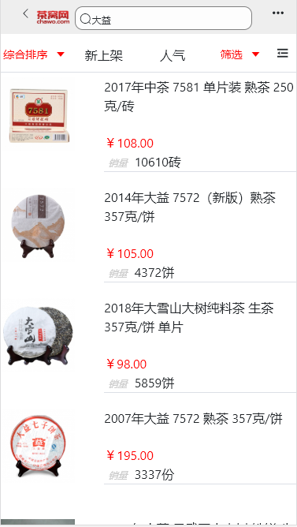
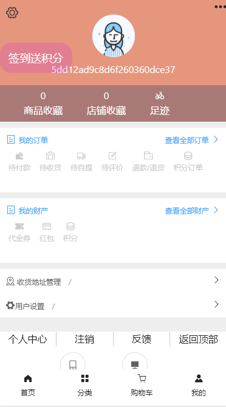

# 茶窝网

## 项目介绍：茶窝app是一款一款主打茶叶购买，茶叶定制的APP，茶窝app里面丰富的茶品，丰富产品给您带来丰富的选择，大师齐聚一起品茶。用茶窝app可以让您挑选到满意的好茶

## 演示

* 官网：<http://www.chawo.com/wap>

* 上线网址:<http://121.199.11.112:8011>

* 后台管理网址:<http://121.199.11.112:8010>

## git仓库地址:git@github.com:gzh51910/ChaWo.git

## 团队与分工

### 团队

* 组长：董伟东，成员：吕紫薇、韦云洪、周石坤
* 负责模块说明：
* 董伟东：爬取数据/编写接口
* 吕紫薇：页面逻辑跳转/功能实现
* 韦云洪：后台管理模块
  * 管理员：老谢   密码：123456
* 周石坤：爬取数据/页面布局

## 项目页面截图

### 首页

### 列表页

### 详情页

### 购物车

### 个人页

### 注册页

### 登录页

### 分类列表页

### 后台管理系统列表页

### 后台登录页

## 项目目录说明

    ├─Api                   //接口文件夹
    │   └─src
    │       ├─db
    │       ├─routers
    │       └─utils
    ├─chawo                 //前端文件夹
    │  ├─public
    │  └─src
    │      ├─api            //接口文件夹
    │      ├─assets
    │      ├─components     //分类列表和脚部
    │      ├─img            //页面截图
    │      ├─pages          //页面
    │      ├─routers        //路由
    │      └─store
    └─chawomanage           //后台管理文件夹
        ├─public
        └─src
            ├─assets
            ├─components
            ├─pages         //页面
            ├─route         //路由
            ├─routers       //路由
            └─utils         //token